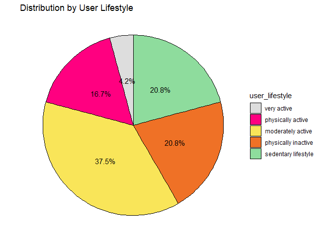
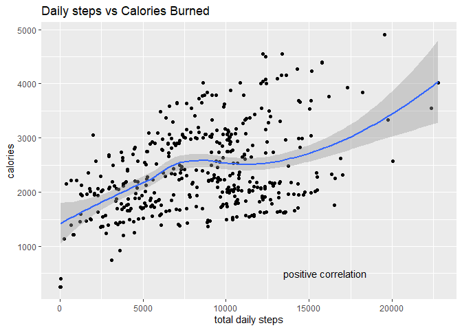
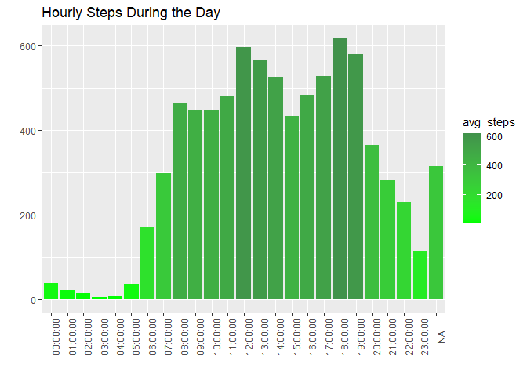
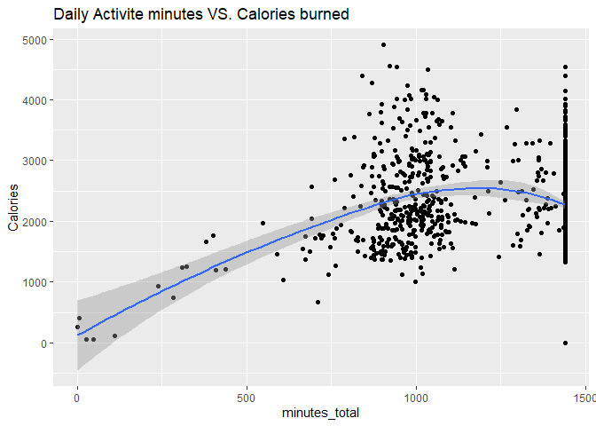
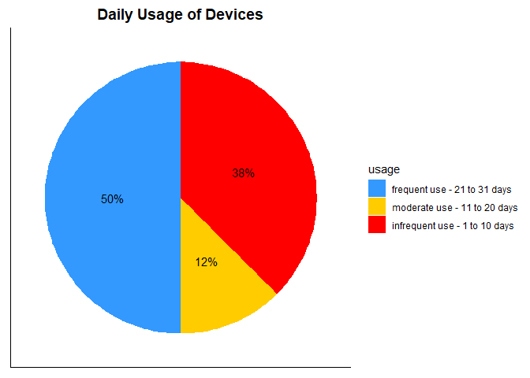
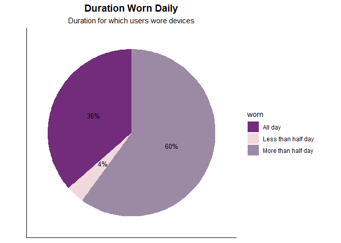
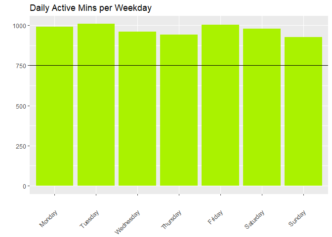
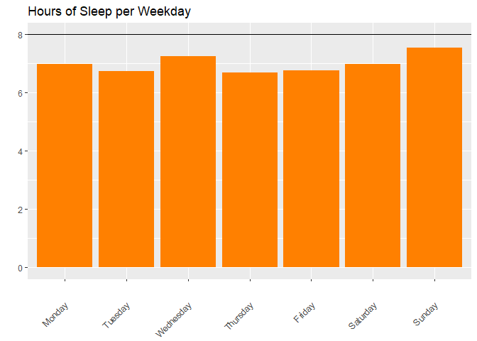

Capstone Case Study: Bellabeats
================
Lumi Luka
2022-12-29

## Summary

Founded in 2013 by Urska Srsen and Sando Mur, Bellabeats is a
tech-driven health and wellness company that manufactures smart products
to enable women to track their health and habits based on their
activity, stress, sleep and reproductive health. Srsen, the Chief
Creative officer, knows that growth opportunities would be revealed from
an analysis of Bellabeat’s customer data. She wants the marketing
analytics team, in which I am a junior data analyst to analyse usage
data of non-Bellabeat smart devices while focusing on a Bellabeat
product. The purpose is to gain insights into how those other devices
are being used by customers and apply the insights to the Bellabeat
product.

**Problem statement:**  
To analyse smart device usage data to gain insights into how consumers
use smart devices and apply these insights to a Bellabeat product

**Goals/metrics:**  
To use insights to reveal growth opportunities

**Deliverables:**  
\* Write a clear summary of the business task  
\* A description of all data sources used  
\* Documentation of any cleaning or manipulation of data  
\* Write a summary of the analysis  
\* Present supporting visualisation and key findings  
\* Make a high-level recommendation based on the analysis

**Website to scrape the needed data:** Click
[here](https://www.kaggle.com/datasets/arashnic/fitbit)

The case study road map follows the data analytics process, Ask,
Prepare, Process, Analyse, Share.

### Ask

The problem here is finding trends in smart device usage. Any insights
gained will come from trends or patterns noticed in the data. This will
drive business decisions. The SMART reference was used while asking
questions. This ensures that the questions asked are Specific,
Measurable, Action-oriented, Relevant and Time-bound.

**Key tasks:**  
\* Identify the business task: The task is to gain insights into how
consumers use non-Bellabeat smart devices and apply those insights to a
Bellabeat product to help guide marketing strategy for the company  
\* Consider key stakeholders: The key stakeholders are Urska Srsen,
Sando Mur, the Bellabeat marketing analytics team and the Bellabeat
customers.

**Deliverable:** A clear statement of the business task

### Prepare

Of the 18 .csv files from the available data we used 3 for the analysis
because they have the most data entries and would give a more accurate
representation. The datasets used:  
\* dailyActivity_merged.csv  
\* dailyCalories_merged.csv  
\* SleepDay_merged.csv  
\* hourlyIntensities_merged.csv  
\* hourlySteps_merged.csv

**Where is the data stored?** The dataset used for this case study is
the Fitbit fitness tracker data stored in Kaggle and available through
Morbius

**How is the data organized?** There are 18 .csv files. The data within
is structured in a rows and columns schema. The data is organized in a
long format. This means that each row is a one-time point per subject.
It contains values (customer ID numbers) that repeat in the first
column.

**Are there issues with bias or credibility in this data?** The dataset
was gathered from the personal data of about 30 participants who
consented to the use of their data. There is sampling bias because it is
quite a small sample size and it does not address all demographics, i.e
age. The data is also outdated since it was collected in the year 2016.

**How are you addressing licensing, privacy, security and
accessibility?** The data is CC0, a creative commons open-source
license. It intends to cover all copyright and database rights. Data in
the public domain are available to other users to reuse, enhance and
build upon without copyright and database law restrictions. The
participants of the survey from which the data was gathered also
consented to the submission of personal tracker data. No personal data
is contained in the data, hence privacy is maintained.

**How did you verify the data’s integrity?** The data is stored on a
verified source – Kaggle. It was generated by respondents to a
distributed survey via Amazon Mechanical Turk, making it third-party
data, which is considered unreliable. The data does not meet the
requirements to be considered ROCCC (Reliable Original Comprehensive
Current Cited).

**Are there any problems with the data?**  
The data is outdated and does not reflex current trends. There are
several missing values

**Key tasks:**  
\* Download data and store it appropriately  
\* Identify how it is organized  
\* Sort and filter the data  
\* Determine the credibility of the data

**Deliverables:**  
A description of all data sources used

### Process

**Tools** I am using R for this analysis for its benefits of being a
great tool for statistical analysis, accessibility, having good
visualisation and can be reshared. The tool was used to transform, clean
and visualise the data.

**What steps have you taken to ensure that the data is clean?**  
I checked the data for errors, blanks, duplicates, extra spaces, and
consistent formats in date, number, date-time, etc.

The following are the steps taken in transforming, cleaning, and
visualising the data.

Load the packages. They are already installed and up to date.

``` r
#load packages

library(tidyverse)
```

    ## ── Attaching packages ─────────────────────────────────────── tidyverse 1.3.2 ──
    ## ✔ ggplot2 3.4.0      ✔ purrr   0.3.4 
    ## ✔ tibble  3.1.7      ✔ dplyr   1.0.10
    ## ✔ tidyr   1.2.1      ✔ stringr 1.5.0 
    ## ✔ readr   2.1.3      ✔ forcats 0.5.2 
    ## ── Conflicts ────────────────────────────────────────── tidyverse_conflicts() ──
    ## ✖ dplyr::filter() masks stats::filter()
    ## ✖ dplyr::lag()    masks stats::lag()

``` r
library(lubridate)
```

    ## Loading required package: timechange
    ## 
    ## Attaching package: 'lubridate'
    ## 
    ## The following objects are masked from 'package:base':
    ## 
    ##     date, intersect, setdiff, union

``` r
library(ggplot2)
```

The .csv files were downloaded and uploaded to R studio. The read_csv()
function was then used to read them. Of the 18 available files a few
have been used because they have more samples compared to the ones not
used. This decision was taken in order to have better results after
difficulties in obtaining more data.

``` r
#create data frames from .csv files

daily_activity <- read_csv("dailyActivity_merged.csv")
```

    ## Rows: 940 Columns: 15
    ## ── Column specification ────────────────────────────────────────────────────────
    ## Delimiter: ","
    ## chr  (1): ActivityDate
    ## dbl (14): Id, TotalSteps, TotalDistance, TrackerDistance, LoggedActivitiesDi...
    ## 
    ## ℹ Use `spec()` to retrieve the full column specification for this data.
    ## ℹ Specify the column types or set `show_col_types = FALSE` to quiet this message.

``` r
daily_calories <- read_csv("dailyCalories_merged.csv")
```

    ## Rows: 940 Columns: 3
    ## ── Column specification ────────────────────────────────────────────────────────
    ## Delimiter: ","
    ## chr (1): ActivityDay
    ## dbl (2): Id, Calories
    ## 
    ## ℹ Use `spec()` to retrieve the full column specification for this data.
    ## ℹ Specify the column types or set `show_col_types = FALSE` to quiet this message.

``` r
daily_sleep <- read_csv("sleepDay_merged.csv")
```

    ## Rows: 413 Columns: 5
    ## ── Column specification ────────────────────────────────────────────────────────
    ## Delimiter: ","
    ## chr (1): SleepDay
    ## dbl (4): Id, TotalSleepRecords, TotalMinutesAsleep, TotalTimeInBed
    ## 
    ## ℹ Use `spec()` to retrieve the full column specification for this data.
    ## ℹ Specify the column types or set `show_col_types = FALSE` to quiet this message.

``` r
hourly_intensities <- read_csv("hourlyIntensities_merged.csv")
```

    ## Rows: 22099 Columns: 4
    ## ── Column specification ────────────────────────────────────────────────────────
    ## Delimiter: ","
    ## chr (1): ActivityHour
    ## dbl (3): Id, TotalIntensity, AverageIntensity
    ## 
    ## ℹ Use `spec()` to retrieve the full column specification for this data.
    ## ℹ Specify the column types or set `show_col_types = FALSE` to quiet this message.

``` r
hourly_steps <- read_csv("hourlySteps_merged.csv")
```

    ## Rows: 22099 Columns: 3
    ## ── Column specification ────────────────────────────────────────────────────────
    ## Delimiter: ","
    ## chr (1): ActivityHour
    ## dbl (2): Id, StepTotal
    ## 
    ## ℹ Use `spec()` to retrieve the full column specification for this data.
    ## ℹ Specify the column types or set `show_col_types = FALSE` to quiet this message.

**To view the data summary and structure.**

We view tibbles containing summaries of the data and also the data
structure of each data frame. This gives an idea of the columns, the
data types and the kinds of trends that can be found in the data.

``` r
#summaries of some of the data frames created. Changed str() function to note to make doc less clunky

head(daily_activity)
```

    ## # A tibble: 6 × 15
    ##        Id ActivityDate TotalSteps TotalDistance TrackerDistance LoggedActivitie…
    ##     <dbl> <chr>             <dbl>         <dbl>           <dbl>            <dbl>
    ## 1  1.50e9 4/12/2016         13162          8.5             8.5                 0
    ## 2  1.50e9 4/13/2016         10735          6.97            6.97                0
    ## 3  1.50e9 4/14/2016         10460          6.74            6.74                0
    ## 4  1.50e9 4/15/2016          9762          6.28            6.28                0
    ## 5  1.50e9 4/16/2016         12669          8.16            8.16                0
    ## 6  1.50e9 4/17/2016          9705          6.48            6.48                0
    ## # … with 9 more variables: VeryActiveDistance <dbl>,
    ## #   ModeratelyActiveDistance <dbl>, LightActiveDistance <dbl>,
    ## #   SedentaryActiveDistance <dbl>, VeryActiveMinutes <dbl>,
    ## #   FairlyActiveMinutes <dbl>, LightlyActiveMinutes <dbl>,
    ## #   SedentaryMinutes <dbl>, Calories <dbl>

``` r
#str(daily_activity)

head(daily_calories)
```

    ## # A tibble: 6 × 3
    ##           Id ActivityDay Calories
    ##        <dbl> <chr>          <dbl>
    ## 1 1503960366 4/12/2016       1985
    ## 2 1503960366 4/13/2016       1797
    ## 3 1503960366 4/14/2016       1776
    ## 4 1503960366 4/15/2016       1745
    ## 5 1503960366 4/16/2016       1863
    ## 6 1503960366 4/17/2016       1728

``` r
#str(daily_calories)

head(daily_sleep)
```

    ## # A tibble: 6 × 5
    ##           Id SleepDay           TotalSleepRecor… TotalMinutesAsl… TotalTimeInBed
    ##        <dbl> <chr>                         <dbl>            <dbl>          <dbl>
    ## 1 1503960366 4/12/2016 12:00:0…                1              327            346
    ## 2 1503960366 4/13/2016 12:00:0…                2              384            407
    ## 3 1503960366 4/15/2016 12:00:0…                1              412            442
    ## 4 1503960366 4/16/2016 12:00:0…                2              340            367
    ## 5 1503960366 4/17/2016 12:00:0…                1              700            712
    ## 6 1503960366 4/19/2016 12:00:0…                1              304            320

``` r
#str(daily_sleep)
```

An inconsistency noticed in the daily_activity data frame makes the team
want to know how often users have their watches on. From the difference
in time it can be assumed that those users do not use their devices all
day. More data needed.

``` r
daily_activity$minutes_total <- daily_activity$VeryActiveMinutes + daily_activity$FairlyActiveMinutes + daily_activity$LightlyActiveMinutes + daily_activity$SedentaryMinutes        #Sum of total minutes as seen in the data. It helps compare active minutes to the number of minutes in a day - 1440 minutes.

sum(daily_activity$minutes_total > 1440)   #Tells us how many users are active all day
```

    ## [1] 0

``` r
sum(daily_activity$minutes_total < 1440)   #Tells how many users are not active all day
```

    ## [1] 462

Another inconsistency is noticed in the daily activity data frame. Some
users have 0 total steps recorded and zero calories burned. If more data
cannot be gathered to fill the gap it will be neglected.

**Cleaning**

Confirming the number of unique ids in the data. The sample below
confirms there are 33 unique Ids. Like with the daily_sleep data frame,
some others had insufficient data due to a lack of entry. For that
reason, they were neglected.

``` r
n_distinct(daily_activity$Id)
```

    ## [1] 33

``` r
n_distinct(daily_calories$Id)
```

    ## [1] 33

``` r
n_distinct(daily_sleep$Id)
```

    ## [1] 24

**Missing values**

Checking for missing values. The data frames being used are complete and
do not contain any missing values.

``` r
sum(is.na(daily_activity))
```

    ## [1] 0

``` r
sum(is.na(daily_calories))
```

    ## [1] 0

``` r
sum(is.na(daily_sleep))
```

    ## [1] 0

**Duplicates**

To find duplicates in each data frame

``` r
sum(duplicated(daily_activity))
```

    ## [1] 0

``` r
sum(duplicated(daily_calories))
```

    ## [1] 0

``` r
sum(duplicated(daily_sleep))
```

    ## [1] 3

Removing dublicates

``` r
daily_sleep <- daily_sleep %>% 
  distinct() %>% 
  drop_na()
```

Checking removal of duplicates in the daily_sleep data frame

``` r
sum(duplicated(daily_sleep))
```

    ## [1] 0

**Renaming columns**

The column names of the data frames used were renamed for consistency,
putting them all in lower case.

``` r
#Created new data frames that have the columns in lower case

daily_activity_df <- rename_with(daily_activity, tolower)
colnames(daily_activity_df)
```

    ##  [1] "id"                       "activitydate"            
    ##  [3] "totalsteps"               "totaldistance"           
    ##  [5] "trackerdistance"          "loggedactivitiesdistance"
    ##  [7] "veryactivedistance"       "moderatelyactivedistance"
    ##  [9] "lightactivedistance"      "sedentaryactivedistance" 
    ## [11] "veryactiveminutes"        "fairlyactiveminutes"     
    ## [13] "lightlyactiveminutes"     "sedentaryminutes"        
    ## [15] "calories"                 "minutes_total"

``` r
daily_calories_df <- rename_with(daily_calories, tolower)
colnames(daily_calories_df)
```

    ## [1] "id"          "activityday" "calories"

``` r
daily_sleep_df <- rename_with(daily_sleep, tolower)
colnames(daily_sleep_df)
```

    ## [1] "id"                 "sleepday"           "totalsleeprecords" 
    ## [4] "totalminutesasleep" "totaltimeinbed"

``` r
hourly_steps_df <- rename_with(hourly_steps, tolower)
```

**Data formats**

The sleepday column is of date-time format. It was converted to ensure
that all formats are consistent.

``` r
#The Rename() function changes the names of variables using new_name = old_name syntax
#The mutate() function is used to change date/ date-time formats here

daily_activity_df <- daily_activity_df %>%
  rename("date" = "activitydate") %>%
  mutate(date = as_date(date, format = "%m/%d/%Y"))

daily_sleep_df <- daily_sleep_df %>%
  rename("date" = "sleepday") %>%
  mutate(date = as_date(date,format ="%m/%d/%Y %I:%M:%S %p"))

hourly_steps_df <- hourly_steps_df %>%
  rename("date_time" = "activityhour") %>%
  mutate(date_time = as.POSIXct(date_time,format ="%m/%d/%Y %I:%M:%S %p" , tz=Sys.timezone()))
```

Summary of the updated data frames

``` r
#head(daily_sleep_df)
#head(hourly_steps_df)
```

**Data frames merged**

The daily activity data frame contains data found in the daily calories
data frame. We merged the daily activity data frame and the daily sleep
data frame by date.

``` r
#Merged daily_activity_df and daily_sleep_df into a new data frame using id and date vectors.

daily_activity_sleep_df <- merge(daily_activity_df, daily_sleep_df, by = c ("id", "date"))
#glimpse(daily_activity_sleep_df)
```

### Analyse

**Key tasks**

- Aggregate your data so it’s useful and accessible.  
- Organize and format your data.  
- Perform calculations.  
- Identify trends and relationships

**Deliverable**  
A summary of the analysis

In this phase, the analysis will reveal a trend in the FitBit user data
being worked with. This will establish how helpful the data is in coming
up with a marketing strategy for our company.

**Assumption**  
In the absence of a demographic we decided to gather additional data.
This leads to a decision to categorise users based on steps taken per
day. The categories according to the
[link](https://www.ncbi.nlm.nih.gov/pmc/articles/PMC5488109/) :

- \<5000 Sedentary lifestyle  
- 5000–7499 Physically inactive  
- 7500–9999 Moderately active  
- ≥10,000 Physically active  
- ≥12,500 Very active

This was used to calculate the average daily steps for each user

``` r
#A summary of averages from the daily_activity_sleep_df grouped by id. 
#Used pipes to link the sequence of the analysis steps, taking the output of one function and passing it into another function as an argument.   

average_steps <- daily_activity_sleep_df %>%
  group_by(id) %>%
  summarise(avg_daily_steps = mean(totalsteps), avg_daily_calories = mean(calories), avg_daily_sleep = mean(totalminutesasleep))

head(average_steps)
```

    ## # A tibble: 6 × 4
    ##           id avg_daily_steps avg_daily_calories avg_daily_sleep
    ##        <dbl>           <dbl>              <dbl>           <dbl>
    ## 1 1503960366          12406.              1872.            360.
    ## 2 1644430081           7968.              2978.            294 
    ## 3 1844505072           3477               1676.            652 
    ## 4 1927972279           1490               2316.            417 
    ## 5 2026352035           5619.              1541.            506.
    ## 6 2320127002           5079               1804              61

Classification based on information stated above using average daily
steps

``` r
#The case_when() lets us print an output value if a condition is met. The conditions here are based on average daily steps taken by each user.
#The data frame is mutated to include a user_lifestlye variable showing each user's lifestyle based on their average daily steps

user_lifestyle <- average_steps %>%
  mutate(user_lifestyle = case_when(
    avg_daily_steps < 5000 ~ "sedentary lifestyle",
    avg_daily_steps >= 5000 & avg_daily_steps < 7499 ~ "physically inactive", 
    avg_daily_steps >= 7500 & avg_daily_steps < 9999 ~ "moderately active", 
    avg_daily_steps >= 10000 & avg_daily_steps< 12500~ "physically active",
    avg_daily_steps >= 12500 ~ "very active"
  ))

head(user_lifestyle)
```

    ## # A tibble: 6 × 5
    ##           id avg_daily_steps avg_daily_calories avg_daily_sleep user_lifestyle  
    ##        <dbl>           <dbl>              <dbl>           <dbl> <chr>           
    ## 1 1503960366          12406.              1872.            360. physically acti…
    ## 2 1644430081           7968.              2978.            294  moderately acti…
    ## 3 1844505072           3477               1676.            652  sedentary lifes…
    ## 4 1927972279           1490               2316.            417  sedentary lifes…
    ## 5 2026352035           5619.              1541.            506. physically inac…
    ## 6 2320127002           5079               1804              61  physically inac…

***What percentage of people are living each lifestyle?*** Knowing this
will let me create a clear visual representation.

``` r
percentage_by_lifestyle <- user_lifestyle %>%    #new data frame
  group_by(user_lifestyle) %>%
  summarise(total = n()) %>%    #aggregate the number of occurrences 
  mutate(totals = sum(total)) %>%
  group_by(user_lifestyle) %>%
  summarise(total_percent = total / totals) %>%       #total percentage calculation
  mutate(labels = scales::percent(total_percent))

percentage_by_lifestyle$user_lifestyle <- factor(percentage_by_lifestyle$user_lifestyle , levels = c("very active", "physically active", "moderately active", "physically inactive", "sedentary lifestyle"))                    #The factor function takes a vector of values (numeric or character). In this case it is the life style of users (character)


head(percentage_by_lifestyle)
```

    ## # A tibble: 5 × 3
    ##   user_lifestyle      total_percent labels
    ##   <fct>                       <dbl> <chr> 
    ## 1 moderately active          0.375  37.5% 
    ## 2 physically active          0.167  16.7% 
    ## 3 physically inactive        0.208  20.8% 
    ## 4 sedentary lifestyle        0.208  20.8% 
    ## 5 very active                0.0417 4.2%

**Time of day most active** Knowing what time of day users are more
active will help the analysis process.

``` r
hourly_steps_df <- hourly_steps_df %>%
  separate(date_time, into = c("date", "time"), sep= " ") %>%
  mutate(date = ymd(date)) 
  
head(hourly_steps_df)
```

    ## # A tibble: 6 × 4
    ##           id date       time     steptotal
    ##        <dbl> <date>     <chr>        <dbl>
    ## 1 1503960366 2016-04-12 00:00:00       373
    ## 2 1503960366 2016-04-12 01:00:00       160
    ## 3 1503960366 2016-04-12 02:00:00       151
    ## 4 1503960366 2016-04-12 03:00:00         0
    ## 5 1503960366 2016-04-12 04:00:00         0
    ## 6 1503960366 2016-04-12 05:00:00         0

***How are users using their devices?***

A calculation of the days users used their devices lead the team to
create a category by usage. This trend will be helpful in coming up with
a marketing strategy for Bellabeat. It shows that a rather high
percentage of users (38%) are not using their devices frequently. 50% of
users use them frequently and 12% use them moderately.

``` r
#Create categories based on device usage

quantified_usage <- daily_activity_sleep_df %>%
  group_by(id) %>%
  summarize(days_used=sum(n())) %>%
  mutate(usage = case_when(
    days_used >= 1 & days_used <= 10 ~ "infrequent use",
    days_used >= 11 & days_used <= 20 ~ "moderate use", 
    days_used >= 21 & days_used <= 31 ~ "frequent use", 
  ))
glimpse(quantified_usage)
```

    ## Rows: 24
    ## Columns: 3
    ## $ id        <dbl> 1503960366, 1644430081, 1844505072, 1927972279, 2026352035, …
    ## $ days_used <int> 25, 4, 3, 5, 28, 1, 15, 28, 8, 26, 23, 28, 5, 27, 31, 26, 18…
    ## $ usage     <chr> "frequent use", "infrequent use", "infrequent use", "infrequ…

``` r
#To find what percentage of users are in each category
percentage_by_usage <- quantified_usage %>%
  group_by(usage) %>%
  summarise(total = n()) %>%
  mutate(totals = sum(total)) %>%
  group_by(usage) %>%
  summarise(total_percent = total / totals) %>%
  mutate(labels = scales::percent(total_percent))

percentage_by_usage$usage <- factor(percentage_by_usage$usage, levels = c("frequent use", "moderate use", "infrequent use"))

head(percentage_by_usage)
```

    ## # A tibble: 3 × 3
    ##   usage          total_percent labels
    ##   <fct>                  <dbl> <chr> 
    ## 1 frequent use           0.5   50%   
    ## 2 infrequent use         0.375 38%   
    ## 3 moderate use           0.125 12%

**Device usage**

It is important to know how often the users have their devices on their
person.

``` r
#Merged daily_activity_df and quantified_usage into a new daily_usage data frame

daily_usage <- merge(daily_activity_df, quantified_usage, by=c ("id"))
head(daily_usage)
```

    ##           id       date totalsteps totaldistance trackerdistance
    ## 1 1503960366 2016-05-07      11992          7.71            7.71
    ## 2 1503960366 2016-05-06      12159          8.03            8.03
    ## 3 1503960366 2016-05-01      10602          6.81            6.81
    ## 4 1503960366 2016-04-30      14673          9.25            9.25
    ## 5 1503960366 2016-04-12      13162          8.50            8.50
    ## 6 1503960366 2016-04-13      10735          6.97            6.97
    ##   loggedactivitiesdistance veryactivedistance moderatelyactivedistance
    ## 1                        0               2.46                     2.12
    ## 2                        0               1.97                     0.25
    ## 3                        0               2.29                     1.60
    ## 4                        0               3.56                     1.42
    ## 5                        0               1.88                     0.55
    ## 6                        0               1.57                     0.69
    ##   lightactivedistance sedentaryactivedistance veryactiveminutes
    ## 1                3.13                       0                37
    ## 2                5.81                       0                24
    ## 3                2.92                       0                33
    ## 4                4.27                       0                52
    ## 5                6.06                       0                25
    ## 6                4.71                       0                21
    ##   fairlyactiveminutes lightlyactiveminutes sedentaryminutes calories
    ## 1                  46                  175              833     1821
    ## 2                   6                  289              754     1896
    ## 3                  35                  246              730     1820
    ## 4                  34                  217              712     1947
    ## 5                  13                  328              728     1985
    ## 6                  19                  217              776     1797
    ##   minutes_total days_used        usage
    ## 1          1091        25 frequent use
    ## 2          1073        25 frequent use
    ## 3          1044        25 frequent use
    ## 4          1015        25 frequent use
    ## 5          1094        25 frequent use
    ## 6          1033        25 frequent use

``` r
#Used the daily_usage data frame to calculate the total minutes users wore their devices daily for
#The minutes_total variable created earlier is used here

mins_worn <- daily_usage %>% 
  mutate(minutes_total = veryactiveminutes+fairlyactiveminutes+lightlyactiveminutes+sedentaryminutes) %>%
  mutate (percent_mins_worn = (minutes_total/1440)*100) %>%
  mutate (worn = case_when(
    percent_mins_worn == 100 ~ "All day",
    percent_mins_worn < 100 & percent_mins_worn >= 50~ "More than half day", 
    percent_mins_worn < 50 & percent_mins_worn > 0 ~ "Less than half day"
  ))

head(mins_worn)
```

    ##           id       date totalsteps totaldistance trackerdistance
    ## 1 1503960366 2016-05-07      11992          7.71            7.71
    ## 2 1503960366 2016-05-06      12159          8.03            8.03
    ## 3 1503960366 2016-05-01      10602          6.81            6.81
    ## 4 1503960366 2016-04-30      14673          9.25            9.25
    ## 5 1503960366 2016-04-12      13162          8.50            8.50
    ## 6 1503960366 2016-04-13      10735          6.97            6.97
    ##   loggedactivitiesdistance veryactivedistance moderatelyactivedistance
    ## 1                        0               2.46                     2.12
    ## 2                        0               1.97                     0.25
    ## 3                        0               2.29                     1.60
    ## 4                        0               3.56                     1.42
    ## 5                        0               1.88                     0.55
    ## 6                        0               1.57                     0.69
    ##   lightactivedistance sedentaryactivedistance veryactiveminutes
    ## 1                3.13                       0                37
    ## 2                5.81                       0                24
    ## 3                2.92                       0                33
    ## 4                4.27                       0                52
    ## 5                6.06                       0                25
    ## 6                4.71                       0                21
    ##   fairlyactiveminutes lightlyactiveminutes sedentaryminutes calories
    ## 1                  46                  175              833     1821
    ## 2                   6                  289              754     1896
    ## 3                  35                  246              730     1820
    ## 4                  34                  217              712     1947
    ## 5                  13                  328              728     1985
    ## 6                  19                  217              776     1797
    ##   minutes_total days_used        usage percent_mins_worn               worn
    ## 1          1091        25 frequent use          75.76389 More than half day
    ## 2          1073        25 frequent use          74.51389 More than half day
    ## 3          1044        25 frequent use          72.50000 More than half day
    ## 4          1015        25 frequent use          70.48611 More than half day
    ## 5          1094        25 frequent use          75.97222 More than half day
    ## 6          1033        25 frequent use          71.73611 More than half day

Further analysis of minutes users wear their devices for

``` r
#percentage of device usage by category
percentage_mins_worn <- mins_worn %>%
  group_by(worn) %>%
  summarise(total = n()) %>%
  mutate(totals = sum(total)) %>%
  group_by(worn) %>%
  summarise(percent_total = total / totals) %>%
  mutate(labels = scales::percent(percent_total))
head(percentage_mins_worn)
```

    ## # A tibble: 3 × 3
    ##   worn               percent_total labels
    ##   <chr>                      <dbl> <chr> 
    ## 1 All day                   0.365  36%   
    ## 2 Less than half day        0.0351 4%    
    ## 3 More than half day        0.600  60%

``` r
#What percentage of the high_use category users wear their devices often
high_use_mins <- mins_worn %>%
  filter(usage == "frequent use")%>%
  group_by(worn) %>%
  summarise(total = n()) %>%
  mutate(totals = sum(total)) %>%
  group_by(worn) %>%
  summarise(percent_total = total / totals) %>%
  mutate(labels = scales::percent(percent_total))
head(high_use_mins)
```

    ## # A tibble: 3 × 3
    ##   worn               percent_total labels
    ##   <chr>                      <dbl> <chr> 
    ## 1 All day                   0.0676 6.8%  
    ## 2 Less than half day        0.0432 4.3%  
    ## 3 More than half day        0.889  88.9%

``` r
#What percentage of the mid_use category users wear their devices often?
mid_use_mins <- mins_worn %>%
  filter(usage == "moderate use") %>%
  group_by(worn) %>%
  summarise(total = n()) %>%
  mutate(totals = sum(total)) %>%
  group_by(worn) %>%
  summarise(percent_total = total / totals) %>%
  mutate(labels = scales::percent(percent_total))
head(mid_use_mins)
```

    ## # A tibble: 3 × 3
    ##   worn               percent_total labels
    ##   <chr>                      <dbl> <chr> 
    ## 1 All day                    0.267 27%   
    ## 2 Less than half day         0.04  4%    
    ## 3 More than half day         0.693 69%

``` r
#What percentage of the low_use category users wear their devices often?
low_use_mins <- mins_worn%>%
  filter (usage == "infrequent use") %>%
  group_by(worn) %>%
  summarise(total = n()) %>%
  mutate(totals = sum(total)) %>%
  group_by(worn) %>%
  summarise(percent_total = total / totals) %>%
  mutate(labels = scales::percent(percent_total))
head(low_use_mins)
```

    ## # A tibble: 3 × 3
    ##   worn               percent_total labels
    ##   <chr>                      <dbl> <chr> 
    ## 1 All day                   0.802  80%   
    ## 2 Less than half day        0.0224 2%    
    ## 3 More than half day        0.175  18%

**What days are users more active and what days are they getting the
most sleep**

Knowing which days users are least and most active can help us come up
with a solution. A sleep pattern will also present great insight.
Analysis reveals high active minutes. It also reveals a low amount of
sleep by users.

``` r
weekday_active_sleep <- daily_activity_sleep_df %>%
  mutate(weekday = weekdays(date))

weekday_active_sleep$weekday <- ordered(weekday_active_sleep$weekday, levels=c("Monday", "Tuesday", "Wednesday", "Thursday",
"Friday", "Saturday", "Sunday"))

 weekday_active_sleep <-weekday_active_sleep %>%
  group_by(weekday) %>%
  summarize (daily_active_mins = mean(minutes_total), daily_sleep = mean(totalminutesasleep/60))

head(weekday_active_sleep)
```

    ## # A tibble: 6 × 3
    ##   weekday   daily_active_mins daily_sleep
    ##   <ord>                 <dbl>       <dbl>
    ## 1 Monday                 991.        6.99
    ## 2 Tuesday               1007.        6.74
    ## 3 Wednesday              960.        7.24
    ## 4 Thursday               940.        6.69
    ## 5 Friday                1002.        6.76
    ## 6 Saturday               977.        6.98

### Share

**Visualisation**

Visualisations give a better interpretation. This is the best and most
effective way to convey findings from an analysis to shareholders.

**Key tasks**  
\* Determine the best way to share your findings.  
\* Create effective data visualizations.  
\* Present your findings.  
\* Ensure your work is accessible.

**Deliverable**  
Supporting visualizations and key findings

The chart reveals that a total amount of users (58.4%) are quite
active - 4.2% very active, 16.7 physically active, and 37.5 moderately
active. A combined 41.6% are not too active - 20.8% both sedentary
lifestyle and physically inactive

``` r
#Colour palette codes tested for the chart - #218C8D #6CCECB #F9E559 #EF7126 #8EDC9D #473E3F #473E3F #E64A45 #DDDDDD #FF0080

mycols4 <- c("#DDDDDD", "#FF0080", "#F9E559", "#EF7126", "#8EDC9D")   #My combination

percentage_by_lifestyle %>% 
  ggplot(aes(x = "", y = total_percent, fill = user_lifestyle)) + 
  geom_bar(width = 1, stat = "identity", colour = "black") +
  coord_polar("y", start = 0) +
  geom_text(aes(label = labels), position = position_stack(vjust = 0.5)) +
  labs(title = "Distribution by User Lifestyle") +
  scale_fill_manual(values = mycols4) + 
  theme_void()
```

<!-- -->

**Correlation**

Established a correlation between daily steps and calories burned. The
chart revealed that the most calories are burned on average by users
taking more steps.

``` r
ggplot(data = daily_activity_sleep_df) + 
  geom_point(mapping = aes(x = totalsteps, y = calories)) +
  geom_jitter(mapping = aes(x = totalsteps, y = calories)) +
  geom_smooth(mapping = aes(x = totalsteps, y = calories)) +
  labs(title = "Daily steps vs Calories Burned", x = "total daily steps", y= "calories") +
  annotate("text", x = 16000, y = 500, label = "positive correlation", colour = "black")
```

    ## `geom_smooth()` using method = 'loess' and formula = 'y ~ x'

<!-- -->

**Period of steps**

Viz for hourly steps per user. The result shows that a lot of steps are
taken by the users during midday and/ or evenings.

``` r
hourly_steps_df %>%
  group_by(time) %>%
  summarize(avg_steps = mean(steptotal)) %>%
  ggplot() +
  geom_col(mapping = aes(x=time, y = avg_steps, fill = avg_steps)) + 
  labs(title = "Hourly Steps During the Day", x="", y="") + 
  scale_fill_gradient(low = "green", high = "#41924B") +
  theme(axis.text.x = element_text(angle = 90))
```

<!-- -->

**Total active minutes vs calories**

Some users have more active minutes than others from the summation of
the ‘veryactiveminutes’, ‘fairlyactiveminutes’, ‘lightlyactiveminutes’,
and ‘sedentaryminutes’ attributes. Using the sum of these minutes, it
was determined that there is some correlation between the total daily
active minutes and the calories burned.

``` r
#Viz of the total active minutes vs calories burned
ggplot(data = daily_activity, mapping = aes(x = minutes_total, y = Calories)) + 
  geom_point() +
  ggtitle("Daily Activite minutes VS. Calories burned") +
  geom_smooth()
```

    ## `geom_smooth()` using method = 'loess' and formula = 'y ~ x'

<!-- -->

**Frequency of device usage and percentage**

During the survey period what percentage of users used their devices
daily

``` r
#Colour options #CCFFFF #00CC00 #FFCC00 #FF0000 #5F021F

percentage_by_usage %>%
  ggplot(aes(x="",y=total_percent, fill=usage)) +
  geom_bar(stat = "identity", width = 1)+
  coord_polar("y", start=0)+
  theme_classic()+
  theme(axis.title.x= element_blank(),
        axis.title.y = element_blank(),
        panel.border = element_blank(), 
        panel.grid = element_blank(), 
        axis.ticks = element_blank(),
        axis.text.x = element_blank(),
        plot.title = element_text(hjust = 0.5, size=14, face = "bold")) +
  geom_text(aes(label = labels),
            position = position_stack(vjust = 0.5))+
  scale_fill_manual(values = c("#3399FF","#FFCC00","#FF0000"),
                    labels = c("frequent use - 21 to 31 days",
                                 "moderate use - 11 to 20 days",
                                 "infrequent use - 1 to 10 days"))+
  labs(title="Daily Usage of Devices")
```

<!-- -->

**Duration worn daily**

From the analysis of minutes worn daily

``` r
  ggplot(percentage_mins_worn, aes(x = "",y=percent_total, fill = worn)) +
  geom_bar(stat = "identity", width = 1) +
  coord_polar("y", start = 0) +
  theme_classic() +
  theme(axis.title.x= element_blank(),
        axis.title.y = element_blank(),
        panel.border = element_blank(), 
        panel.grid = element_blank(), 
        axis.ticks = element_blank(),
        axis.text.x = element_blank(),
        plot.title = element_text(hjust = 0.5, size=14, face = "bold"),
        plot.subtitle = element_text(hjust = 0.5)) +
    scale_fill_manual(values = c("#732C7B", "#EFD9DC", "#9C8AA5")) +
  geom_text(aes(label = labels),
            position = position_stack(vjust = 0.5), size = 3.5) +
  labs(title="Duration Worn Daily", subtitle = "Duration for which users wore devices")
```

<!-- -->

**Most active days by total active minutes**

According to the graph, users maintain high active minutes, Tuesday and
Friday being the highest. Users appear to not be getting the recommended
minutes of sleep according to the second chart. The recommended amount
of sleep for an adult aged 18 - 60years is 7hours+ according to
[link](https://www.ncbi.nlm.nih.gov/pmc/articles/PMC4434546/#:~:text=Current%20evidence%20supports%20the%20general,%2C%20medical%2C%20and%20environmental%20factors.).
We do not have age data, but we assume that the users fall in this
range. According to the same source, Individual variation in sleep need
is influenced by genetic, behavioral, medical, and environmental
factors, which we do not have.

``` r
ggplot(weekday_active_sleep) +
      geom_col(aes(weekday, daily_active_mins), fill = "#AAF200") +
      geom_hline(yintercept = 750) +     #This assumes a recommended total active minutes of the value displayed
      labs(title = "Daily Active Mins per Weekday", x= "", y = "") +
      theme(axis.text.x = element_text(angle = 45,vjust = 0.5, hjust = 1))
```

<!-- -->

``` r
ggplot(weekday_active_sleep, aes(weekday, daily_sleep)) +
      geom_col(fill = "#FF8000") +
      geom_hline(yintercept = 8) +
      labs(title = "Hours of Sleep per Weekday", x= "", y = "") +
      theme(axis.text.x = element_text(angle = 45,vjust = 0.5, hjust = 1))
```

<!-- -->

### Summary and Recommendation

**Summary**

- The FitBit time piece serves a similar purpose as Bellabeat’s Time and
  Leaf products. Thus, why we focused our analysis on its data.

- The analysis revealed that while some users maintain an active life
  style, quite a lot maintain an inactive or sedentary lifestyle.

- The analysis revealed that a lot of steps are taken by noon (12pm-2pm)
  and evenings (6pm-7pm).

- A correlations is revealed between the daily/ total steps and the
  amount of calories burned. It shows that higher calories are burned by
  those taking more steps.

- A correlation is revealed between the daily active minutes and
  calories burned. It shows that more calories are burned by users with
  higher active minutes.

- The analysis revealed that a high percentage of users (38%) did not
  use their devices frequently. A high percentage (62% combined) used
  their devices moderately and frequently.

- The analysis revealed that a good amount of users have their devices
  on for at least half a day.

- It is revealed that users are not getting enough sleep daily. Only one
  day of the week records a sufficient average of sleep hours.

**Recommendation**

- We have the Bellabeat Time and Leaf products, which track sleep and
  other vital data. A feature that lets users set a bedtime and a
  wake-up time will help them meet the recommended sleep hours. We
  should also consider doing a weekly summary of sleep hours to help our
  users adjust according to their needs.

- We should convince the users to wear and use their devices more often.
  We can lay emphasis on the kinds of data they can keep track of in all
  environments (dry or wet). Emphases on the privacy of their data can
  encourage them.

- Daily reminders to take steps, exercise, sleep, etc. can help our
  users to be mindful of their activities. Helpful articles or short
  videos on the importance of these things could be of great benefit.  
  We want to keep users active. We can collect data from the users on
  why if for any reason they do not walk, stay active, or sleep enough,
  and come up with suggestions and help based on their responses. They
  do pay a fine subscription after all hahaha

- The data analysed did not reveal gender-specific information. Our
  business focuses on the wellness of women. I suggest we use specific
  data we have collected in this regard for a more accurate analysis.

***Thank you***
